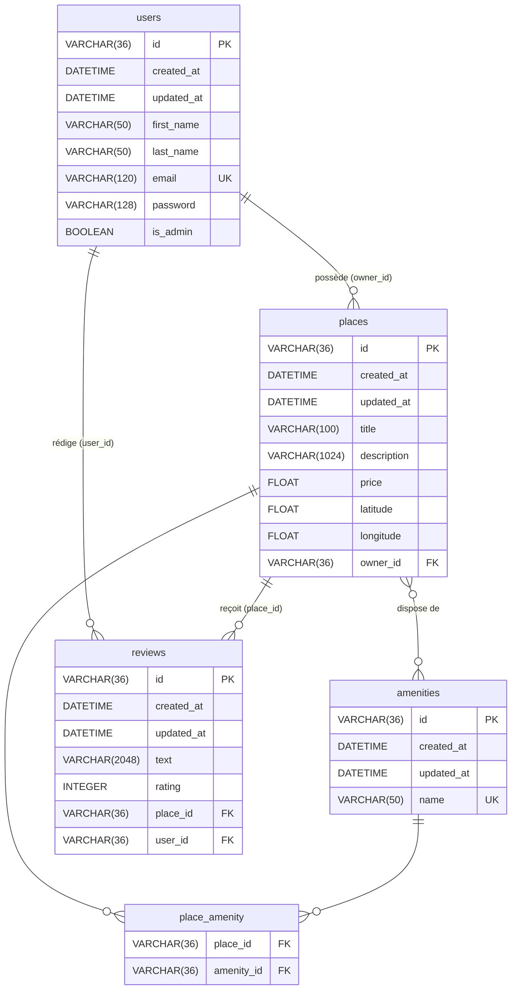

# HBnB — Diagramme Entité-Relation (ER)

Schéma de la base de données HBnB représenté avec [Mermaid.js](https://mermaid.js.org/).

## Diagramme ER

## Relations

| Relation | Type | Description |
|---|---|---|
| `users` → `places` | One-to-Many | Un utilisateur possède zéro ou plusieurs lieux |
| `users` → `reviews` | One-to-Many | Un utilisateur rédige zéro ou plusieurs avis |
| `places` → `reviews` | One-to-Many | Un lieu reçoit zéro ou plusieurs avis |
| `places` ↔ `amenities` | Many-to-Many | Via la table pivot `place_amenity` |

## Contraintes

- Toutes les suppressions se propagent en cascade (`ON DELETE CASCADE`)
- `users.email` : unique
- `amenities.name` : unique
- `reviews.rating` : entier entre 1 et 5 (`CHECK`)
- Clés primaires : UUID v4 (VARCHAR 36)
